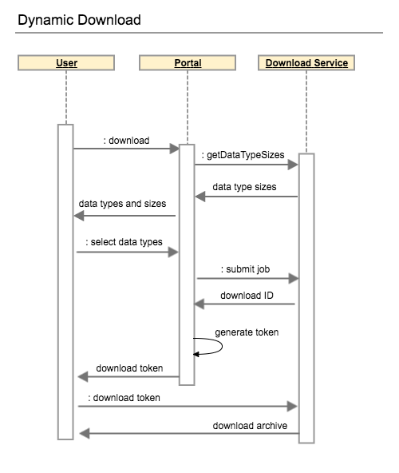

# ICGC DCC - Data Download Server

Entry point to the download server.

## Overview
The download service serves download files prepared by the [ETL](https://github.com/icgc-dcc/dcc-release) system. The download files are either `static`(e.g. all clinical, SSM per project) or `dynamic` (generated by an [advanced search query](https://dcc.icgc.org/search).)

#### Dynamic Download

A dynamic download workflow is depicted on the following sequence diagram.



where the steps are:

1. User selects a search criteria and is forwarded to the download page.
2. Portal resolves the search criteria to a list of donor IDs and sends a `getDataTypeSizes` to the download server.
3. Download server responds with **all** data types and their sizes available for the list of donors.
4. Portal filters data types according to the user permissions(e.g. `open` if the user is not authorized).
5. User select data types he/she wants to download and submits a download request.
6. Portal submits a download job to the download server. Download server resolves donor ids and data types from the request to a list of download files; generates a `download ID`; stores files to its database; and returns the `download ID` to the Portal.
7. Portal creates a JWT token which contains the `download ID` and `user name` of the user (`anonymous` is case of an unauthorized user).
8. Portal sends a redirect link which points to the download server and contains the token.
9. User requests the download archive from the download server using the download token.
10. Download server verifies the token, user name and streams the download archive back to the User.

#### JWT Token

[JSON Web Tokens](https://jwt.io/) are used to transmit information about archive download between the Portal, User and Download server.

A token is encrypted and signed by the Portal. The download server shares with Portal the same symmetric key to decrypt the token and verifies that it was issued by the Portal (by sharing the same secret use for signature verification).

The download server also performs additional token verifications:

 - The token is not expired. Usual TTL is 1 hour.
 - The archive being downloaded belongs to the user specified in the token.

**Note:** a token can be used more than once, thus making it possible to use it with CLI tools.

###### Token Payload
Token payload differs for dynamic download and static one.

A payload of a dynamic download token has following is following:

```json
{
  "exp": 1467131989,
  "iat": 1467128389,
  "id": "zzz123",
  "jti": "a5e65d18-16c0-41e3-9ac8-cfbf1d98f690",
  "user": "ollie.operator"
}
```
where, `exp` - expiration time, `iat` - issue time and `jti` - token ID are standard claims and `user` - download user and `id` - download ID are custom DCC claims.

A static file download token has following payload:

```json
{
  "exp": 1467131989,
  "iat": 1467128389,
  "jti": "ed77a811-f4a2-4a53-bedb-1a41245ebeda",
  "path": "/some/download/path"
}
```

### Virtual file system

The download server relies on a particular file system layout. In case some directories are missing it will not start.

###### Release name

The download server assumes that directory name, which contains release data, starts with the `release_` prefix followed by a release number. For example, `release_23`.

###### Directories layout

The download server data input directory (`job.inputDir` option in the [configuration file](https://github.com/icgc-dcc/dcc-download/blob/develop/dcc-download-server/src/main/resources/application.yml)) has the following structure:

```shell
.
├── README.txt
└── release_23
    ├── data
    ├── headers
    ├── projects_files
    ├── README.txt
    └── summary_files
```

where

 - `data` directory contains compressed clinical files. 
 - `headers` directory contains header files for the clinical files.
 - `project_files` static files in a release [Projects](https://dcc.icgc.org/releases/current/Projects) directory. E.g. a `README.txt` file.
 - `summary_files` static files in a release [Summary](https://dcc.icgc.org/releases/current/Summary) directory. E.g. `simple_somatic_mutation.aggregated.vcf.gz` file.

## Building

```shell
$ mvn -am -pl dcc-download-server package
```


## Running

To run (SSL enabled by default):

```shell
$ java -cp src/main/conf/application.yml -jar target/dcc-download-server-<version>.jar 
...
<app starts and listens on port 8443>
```

## Security
To enable security (communication over SSL and BASIC authentication of the application endpoint) run application with profile `secure`, e.g. 

```shell
$ java -jar <jar_file> --spring.profiles.active=production,secure
```

**N.B.** Note, it's not enough to include the `secure` profile into another one in the `application.yml`. The profile must be specified on the command like as mentioned above.

## Generation of certificates
Follow [instructions](https://github.com/veeti/manuale) to get free certificates. If you have any problems with Python installation consult your Python guru.
You will cet back 4 files:

```
your_domain.chain.crt
your_domain.crt
your_domain.intermediate.crt
your_domain.pem
```
where `your_domain.crt` is a public key and `your_domain.pem` is a private key.

Next, generate PCK12 keystore and set some password (assuming it's 'password')

```
openssl pkcs12 -export -in your_domain.crt -inkey your_domain.pem -out identity.p12 -name "tomcat"
```
Next, convert to JKS

```
keytool -importkeystore -deststorepass password -destkeypass password -destkeystore letsencrypt.jks -srckeystore identity.p12 -srcstoretype PKCS12 -srcstorepass password -alias tomcat
```

